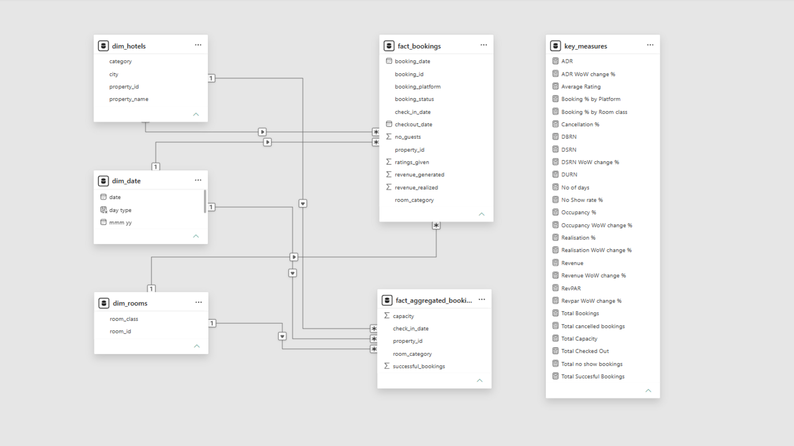
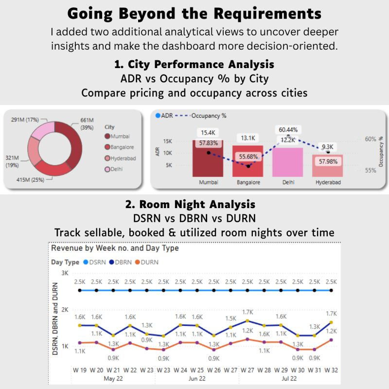

# Hospitality Revenue Analytics - Enterprise Power BI Dashboard

👉 [Live Interactive Dashboard](#)

📊 [Download Static Dashboard Presentation](#)

💼 [My Portfolio](#)

🔗 [LinkedIn Profile](#)

---

## 📌 Project Objective
Architected an end-to-end Business Intelligence solution for AtliQ Grands to monitor real-time operational capacity, track booking platform profitability, and implement data-driven yield management across their hotel network. This project equips hospitality executives with actionable insights into regional pricing power, weekend occupancy surges, and cancellation trends to optimize revenue per available room (RevPAR).

---

### 🏗️ Global Baseline & Architecture Overview

Before isolating specific filtered timelines or regions, the model establishes a macro-level baseline to evaluate all-time enterprise volume versus operational utilization.

**1. Data Architecture & Modeling**
The back end runs on a relational Star Schema connecting high-volume transactional fact tables with dimension tables. All business logic is consolidated into a dedicated `key_measures` table.
* **Fact Tables:** `fact_bookings` tracks transactional guest data (booking status, ratings given, revenue realized), while `fact_aggregated_bookings` manages daily capacity and successful bookings at the property level.
* **Dimension Tables:** Incorporates `dim_date` (with custom day types), `dim_hotels` (categorized by property and city), and `dim_rooms` (by room class).

**2. Executive Oversight: Macro Baseline Analysis**
Looking at the unfiltered historical overview for the entire 92-day dataset:
* **Top-Line Scale vs. Utilization:** The enterprise generated a total baseline of **1.69bn in Revenue** with an overall **57.79% Occupancy** rate. The Average Daily Rate (ADR) stood at **12.70K**, resulting in a RevPAR of **7.34K** across **2.53K** Daily Sellable Room Nights (DSRN).
* **Category & Day Type Disparities:** The 'Luxury' property category dominated revenue generation, capturing **61.62%** (approx 1bn) of the total share. Weekends consistently outperformed weekdays, generating a **62.6% Occupancy** and **7,972 RevPAR**, compared to the weekday **55.8% Occupancy** and **7,083 RevPAR**.
* **Booking Platform Realisation:** Direct offline channels and MakeYourTrip struggled with realisation drop-offs, whereas direct online and tripster maintained higher realisation floors, averaging around the overall network baseline of **70.14%**. AtliQ Exotica in Mumbai served as the top-performing individual property, capturing **117M Revenue** and a **65.9% Occupancy**.

---

### 🧠 Engineered DAX Logic & Calculations
The reporting suite executes 26 centralized DAX calculations to enforce data governance and dynamic visual behavior across all views:

* **Context-Aware Time Intelligence:** Built rolling Week-over-Week (WoW) metrics using variable evaluation (`HASONEFILTER`, `SELECTEDVALUE`) to prevent metric breakage upon user filtering. 
* **Custom Day Type Definitions:** Re-engineered the standard calendar functionality to map the hospitality industry's definition of a weekend (Friday and Saturday).
* **Core Yield Economics:** Automated dynamic tracking for capacity usage via formulas like Realisation % (`1 - ([Cancellation %] + [No Show rate %])`) and Occupancy % (`DIVIDE([Total Succesful Bookings], [Total Capacity], 0)`).

📥 **[View the complete DAX Measures Documentation](docs/DAX_Measures_Reference.pdf)**

---

### 📊 Timeline & Regional Performance Deep-Dive

Filtering down specifically to individual months and cities eliminates aggregation noise and highlights regional elasticity and seasonal plateaus.

#### 1. Timeline Trajectory (May - July 2022)
* **May 2022 Peak:** The quarter opened with strong volume, generating **581.93M in Revenue** and **7.43K RevPAR**. Occupancy peaked at **58.55%** alongside an ADR of **12.68K**.

* **June 2022 Contraction:** Demand softened in June, dropping to **553.93M in Revenue** and a **57.60% Occupancy** rate. Realisation stabilized at **70.05%**.

* **July 2022 Plateau:** July numbers mirrored June closely, recording **551.90M in Revenue** and a slight dip to **57.19% Occupancy**. ADR experienced a marginal increase to **12.72K**, keeping RevPAR steady at **7.28K**.

#### 2. Regional City-Level Economics (Custom Analysis)
* **Mumbai (Volume & Premium Pricing):** Mumbai dominated the network, capturing **660.64M Revenue** with the highest ADR at **15.38K**. Properties realized a **70.24%** completion rate on a **57.83% Occupancy**.

* **Bangalore (Steady Mid-Tier):** Bangalore delivered **415.03M Revenue** with a solid **13.13K ADR**. However, it recorded the lowest regional occupancy at **55.68%**.

* **Delhi (Maximum Utilization):** Delhi achieved the highest relative utilization with a **60.44% Occupancy** rate. It generated **290.92M in Revenue** at an ADR of **12.16K**.

* **Hyderabad (High Conversion, Low Yield):** Hyderabad reported strong utilization (**57.98% Occupancy**) and realization (**70.28%**), but generated only **321.17M Revenue** due to a significantly lower ADR of **9.32K**.

#### 3. Room Night & Capacity Deep Dive
* **Capacity Constraints vs. Demand:** Tracking DSRN (Daily Sellable Room Nights) against DBRN (Booked) and DURN (Utilized) revealed that weekend surges put pressure on inventory. While ADR holds relatively steady across the week (**12,682 Weekday** vs **12,725 Weekend**), the sheer volume of Weekend Occupancy (**62.6%**) drives massive RevPAR spikes (**7,972 Weekend** vs **7,083 Weekday**).

---

### 💻 Technical Competencies

* **Tool:** Power BI Desktop / Power BI Service
* **Data Modeling:** Star Schema (Fact & Dimension Tables, 1-to-Many active relationships)
* **Calculations:** Advanced DAX (Data Analysis Expressions, Time Intelligence, Variable Evaluation)
* **UI/UX Design:** Page Navigation, Custom Tooltips, Conditional Formatting, Interactive Gauges and Matrices
